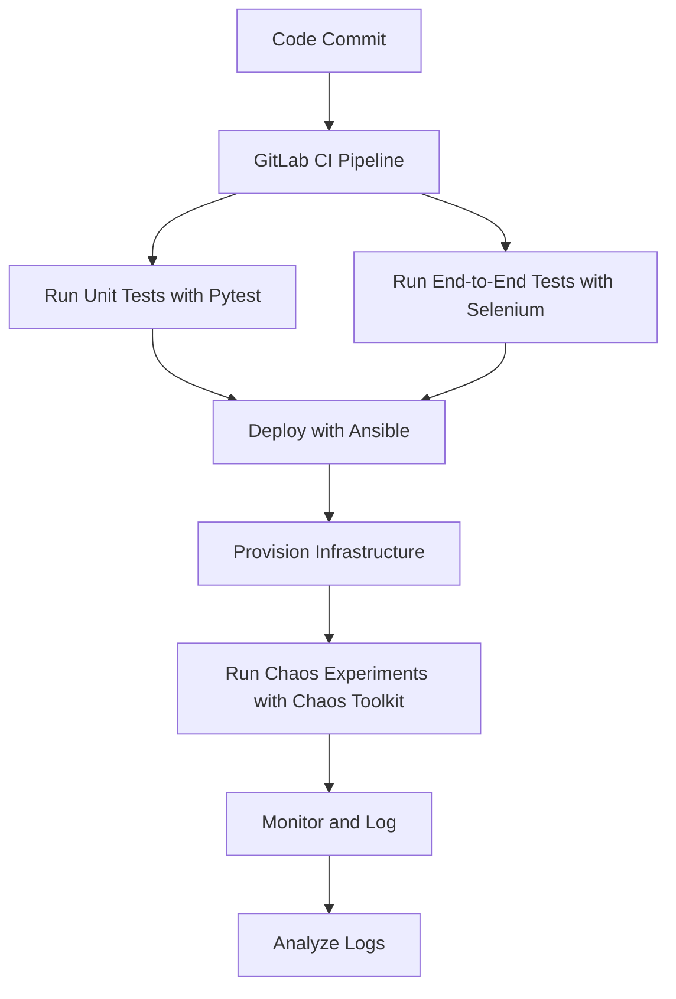

# DevOps Mastery Suite with GitLab CI, Ansible, Pytest, Selenium, and Chaos Engineering

**The DevOps Mastery Suite** integrates various DevOps tools and practices to create a **robust**, **efficient**, and **secure CI/CD pipeline**. This project leverages **GitLab CI** for continuous integration, **Ansible** for infrastructure automation, **Pytest** for unit testing, **Selenium** for end-to-end testing, and **Chaos Engineering** for resilience testing. The suite also includes the use of **AWS-native services**, providing a complete and versatile environment for modern DevOps practices.

---

## Project Workflow

Here's a detailed explanation of the project's workflow and the role of each component:

1. **GitLab CI for Continuous Integration**
   - **Purpose:** Automate the build, test, and deployment processes.
   - **Functionality:** Defined in the `.gitlab-ci.yml` file, the pipeline specifies different stages (*test*, *deploy*, *chaos*) and the scripts to be executed at each stage.

2. **Ansible for Infrastructure Automation**
   - **Purpose:** Automate the provisioning and configuration of infrastructure components.
   - **Functionality:** Manages both the application deployment and the underlying infrastructure using playbooks and roles.

3. **Pytest for Unit Testing**
   - **Purpose:** Ensure code quality and reliability.
   - **Functionality:** Unit tests are defined in the `tests/unit` directory.

4. **Selenium for End-to-End Testing**
   - **Purpose:** Validate the functionality of web applications.
   - **Functionality:** Tests are automated to run in the CI/CD pipeline, defined in the `tests/e2e` directory.

5. **Chaos Engineering with Chaos Toolkit**
   - **Purpose:** Test the system's resilience by introducing controlled failures.
   - **Functionality:** These experiments observe how the system responds and recovers.

6. **AWS Services for Infrastructure**
   - **Purpose:** Provide scalable and reliable infrastructure components.
   - **Functionality:** Utilize **EC2**, **RDS**, **S3**, and **Lambda** for different aspects of the infrastructure.

---

## Workflow Summary

1. **Code Commit:** Developers commit code changes to the GitLab repository.
2. **Continuous Integration:**
   - GitLab CI triggers the pipeline.
   - Runs unit tests using **Pytest** to validate code quality.
   - Executes end-to-end tests using **Selenium** to ensure the application's functionality.
3. **Deployment:**
   - Ansible playbooks deploy the application to the specified environment (e.g., production, staging).
   - Infrastructure components (e.g., web servers, databases) are provisioned and configured using Ansible roles.
4. **Chaos Engineering:**
   - Chaos Toolkit runs experiments to test system resilience.
   - Introduces failures (e.g., terminating EC2 instances) and monitors system recovery.
5. **Monitoring and Logging:**
   - Continuous monitoring of application and infrastructure using AWS CloudWatch and other tools.
   - Logs are collected and analyzed to ensure smooth operation and quick issue resolution.

---

### Flowchart of the Workflow



---


### Tools and Technologies

- **GitLab CI:** Automates the CI/CD process, ensuring continuous integration and deployment.
- **Ansible:** Manages infrastructure as code (IaC) to automate the provisioning, configuration, and deployment of resources.
- **Pytest:** Ensures code quality by running automated unit tests.
- **Selenium:** Validates the functionality of the web application from the end-user perspective.
- **Chaos Toolkit:** Tests the system's resilience by introducing controlled failures and observing how the system recovers.
- **AWS Services:**
  - **EC2:** For scalable compute resources.
  - **RDS:** For managed relational databases.
  - **S3:** For scalable storage.
  - **Lambda:** For serverless computing.

---

### Project Structure

Here's the directory structure of the project:

```
DevOps-Mastery-Suite/
├── ansible/
│   ├── playbooks/
│   │   ├── site.yml
│   │   └── roles/
│   │       ├── webserver/
│   │       │   └── tasks/
│   │       │       └── main.yml
│   │       └── database/
│   │           └── tasks/
│   │               └── main.yml
│   └── inventory/
│       ├── production
│       └── staging
├── gitlab-ci/
│   └── .gitlab-ci.yml
├── scripts/
│   ├── deploy.sh
│   ├── run_tests.sh
│   └── chaos_test.sh
├── tests/
│   ├── unit/
│   │   └── test_sample.py
│   └── e2e/
│       └── test_webapp.py
├── selenium/
│   └── test_login.py
├── chaos/
│   └── chaos_experiment.py
├── aws/
│   ├── ec2_instance_setup.yml
│   ├── lambda_function.py
│   └── rds_setup.yml
├── README.md
└── docs/
    └── project_overview.md
```

By integrating these tools and practices, the DevOps Mastery Suite provides a comprehensive and resilient DevOps environment, leveraging modern CI/CD methodologies and infrastructure automation to ensure high-quality software delivery.
